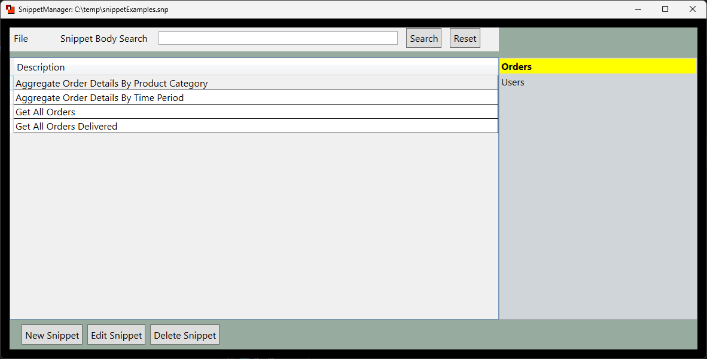

# Snippet Manager

A simple desktop application for organizing snippets of text and easily copying 
snippets to the clipboard for insertion elsewhere.  Uses a local file to store 
the snippets.  Can be used for things like managing SQL queries or MongoDB 
aggregation pipeline examples.  Clicking on a snippet automatically copies it to
the clipboard.  To get started, when opening for the first time, click the menu option File -> New.

